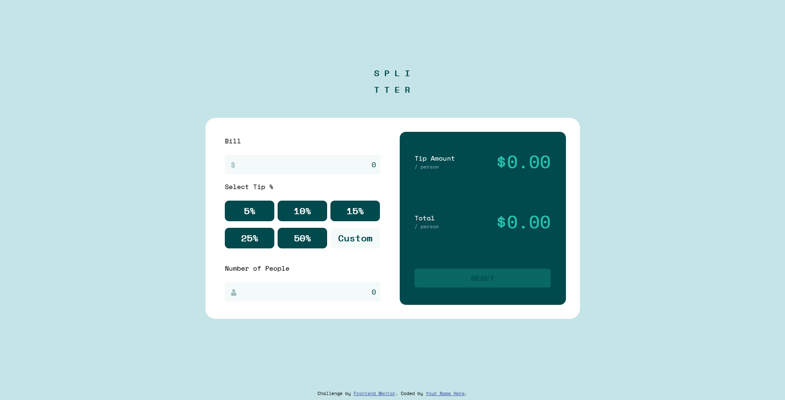
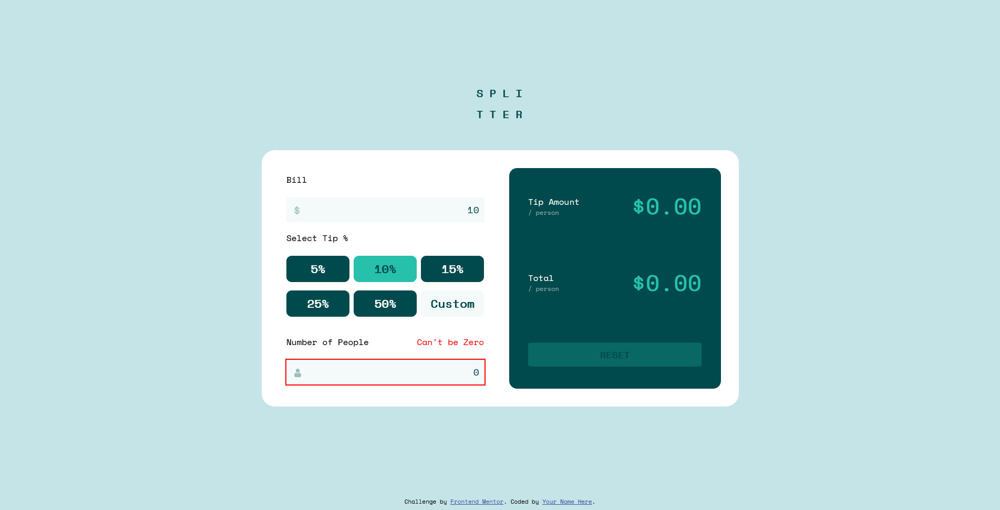
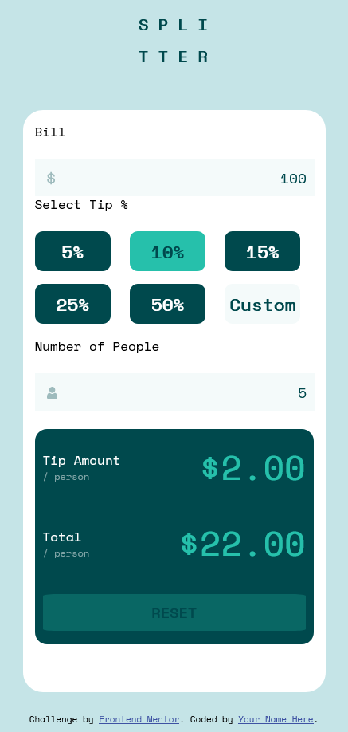

# Frontend Mentor - Testimonials grid section solution

This is a solution to the [Tip calculator app challenge on Frontend Mentor](https://www.frontendmentor.io/challenges/tip-calculator-app-ugJNGbJUX). Frontend Mentor challenges help you improve your coding skills by building realistic projects.

## Table of contents

- [Overview](#overview)
  - [The challenge](#the-challenge)
  - [Screenshot](#screenshot)
  - [Links](#links)
- [My process](#my-process)
  - [Built with](#built-with)
  - [Useful resources](#useful-resources)
- [Author](#author)

## Overview

### The challenge

Users should be able to:

- View the optimal layout for the app depending on their device's screen size
- See hover states for all interactive elements on the page
- Calculate the correct tip and total cost of the bill per person

### Screenshot

### Links

- Solution URL: https://github.com/MAwaisRafiq/Testimonial-Grid-CSS
- Live Site URL: https://mawaisrafiq.github.io/Testimonial-Grid-CSS/

## My process

### Built with

- SCSS
- HTML
= javascript

### Useful resources

- vscode
- firefox

## Author
- Frontend Mentor - [@MAwaisRafiq](https://www.frontendmentor.io/profile/MAwaisRafiq)

